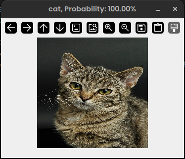

# Project Title
Animal image classification

## Description
Build a CNN model to recognize animal images.

## Getting Started

### Dependencies
- OS: Linux 22.04.5 LTS or higher
- Python 3.10.12 or higher
- NumPy 2.1.3 or higher
- PyTorch 2.6.0 or higher
- OpenCV 4.11.0.86 or higher
- tqdm 4.67.1 or higher
- scikit-learn 1.6.1 or higher
- argparsee 1.4.0 or higher
- matplotlib 3.10.0 or higher

### Downloading the Dataset
- Link to the dataset: [Animal Dataset](https://drive.google.com/drive/folders/1S-2s3Hwh6xfQilhyqaJddcI5gj6FngBw)

### Executing the Program
1. Install PyTorch (if not already installed):
```
pip install torch
```

2. Install NumPy (if not already installed):
```
pip install numpy
```

3. Install OpenCV (if not already installed):
```
pip install opencv-python
```

4. Install tqdm (if not already installed):
```
pip install tqdm
```
5. Install scikit-learn (if not already installed):
```
pip install scikit-learn
```
6. Install argparse (if not already installed):
```
pip install argparse 
```

7. Install matplotlib (if not already installed)
```
pip install matplotlib
```


8. Run `train.py` to train the model. You can modify hyperparameters in the `get_args()` function.
9. Draw a grayscale image (e.g., using Microsoft Whiteboard or similar tools).
10. Save the image and update the `image_path` hyperparameter in `inference.py`.
10. Run `inference.py`.

## Sample Result

